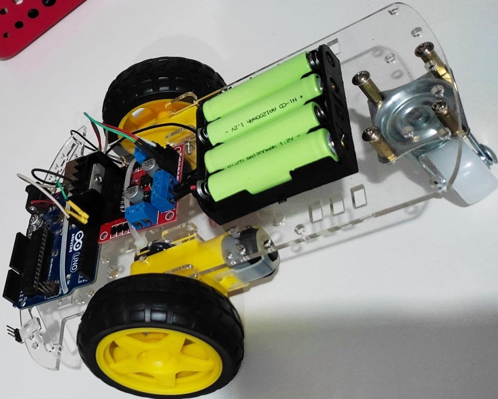

<div align="center" id="top"> 
  

  &#xa0;

  <!-- <a href="https://seguidordelinha.netlify.com">Demo</a> -->
</div>

<h1 align="center">Seguidor De Linha</h1>

<p align="center">
  

  

  

  

  <!--  -->

  <!--  -->

  <!--  -->
</p>

<!-- Status -->

<!-- <h4 align="center"> 
	🚧  Seguidor De Linha 🚀 Em construção...  🚧
</h4> 

<hr> -->

<p align="center">
  <a href="#dart-sobre">Sobre</a> &#xa0; | &#xa0; 
  <a href="#sparkles-funcionalidades">Funcionalidades</a> &#xa0; | &#xa0;
  <a href="#rocket-tecnologias">Tecnologias</a> &#xa0; | &#xa0;
  <a href="#white_check_mark-pré-requisitos">Pré requisitos</a> &#xa0; | &#xa0;
  <a href="#checkered_flag-começando">Começando</a> &#xa0; | &#xa0;
  <a href="#memo-licença">Licença</a> &#xa0; | &#xa0;
  <a href="https://github.com/luizamarlene" target="_blank">Autor</a>
</p>

<br>

## :dart: Sobre ##

Neste projeto é desenvolvido um robô seguidor de linha controlado pela plataforma Arduino. Os Robôs seguidores de linha basicamente são robôs pré-programados cuja função é, através da leitura de sensores, detectar onde existe um caminho em uma superfície (uma linha, muitas vezes feita com fita isolante) e seguir este caminho, daí vem o seu nome 'Seguidor de linha'.

## :sparkles: Funcionalidades ##

:heavy_check_mark: Funcionalidade 1;\
:heavy_check_mark: Funcionalidade 2;\
:heavy_check_mark: Funcionalidade 3;

## :rocket: Tecnologias ##

As seguintes ferramentas foram usadas na construção do projeto:

- [Arduino - Uno](https://www.arduino.cc/en/software)
- [Ponte H](https://www.filipeflop.com/produto/driver-motor-ponte-h-l298n/)
- [Sensor de Refletância QRE - Analógico](https://www.robocore.net/sensor-robo/sensor-de-linha-qre-analogico)

## :white_check_mark: Pré requisitos ##

Antes de começar :checkered_flag:, você precisa ter o [Git](https://git-scm.com) e o [Node](https://nodejs.org/en/) instalados em sua maquina.

## :checkered_flag: Começando ##

```bash
# Clone este repositório
$ git clone https://github.com/luizamarlene/seguidor-de-linha

# Entre na pasta
$ cd seguidor-de-linha

# Instale as dependências
$ yarn

# Para iniciar o projeto
$ yarn start

# O app vai inicializar em <http://localhost:3000>
```

## :memo: Licença ##

Este projeto está sob licença MIT. Veja o arquivo [LICENSE](LICENSE.md) para mais detalhes.


Feito com :heart: por <a href="https://github.com/luizamarlene" target="_blank">Luiza Marllene</a>

&#xa0;

<a href="#top">Voltar para o topo</a>
